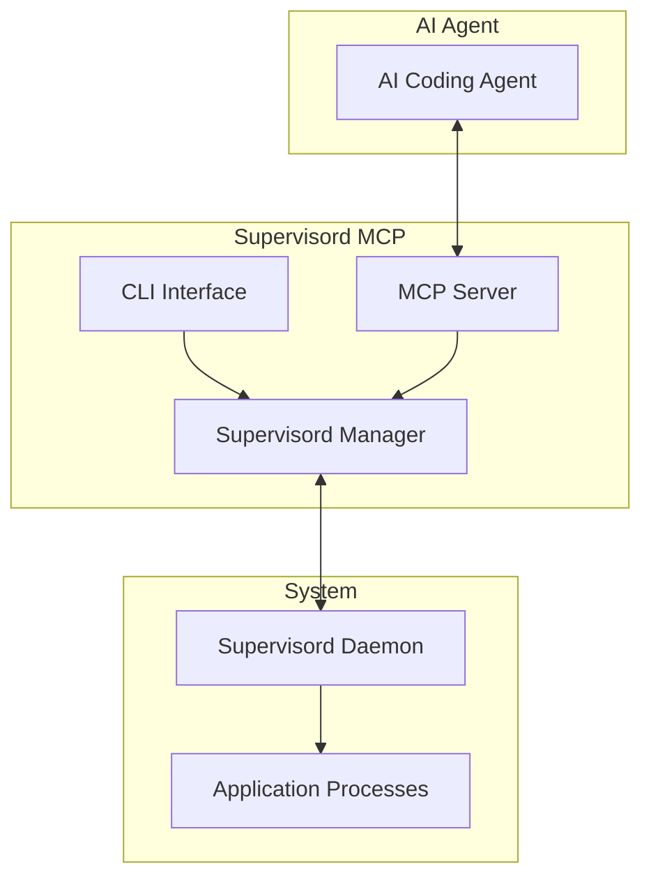
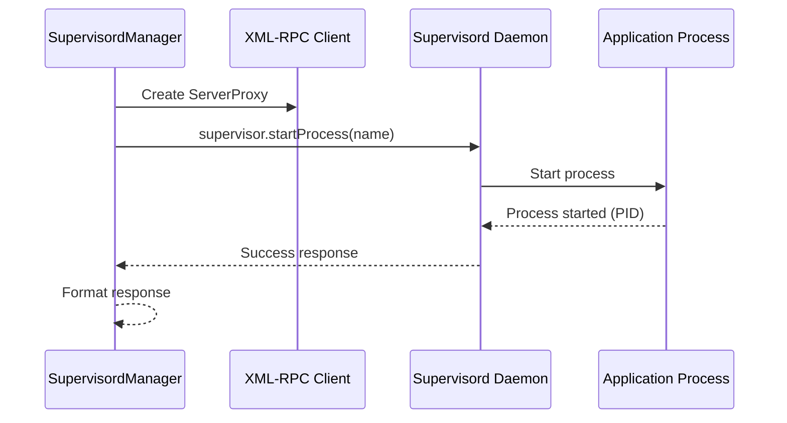
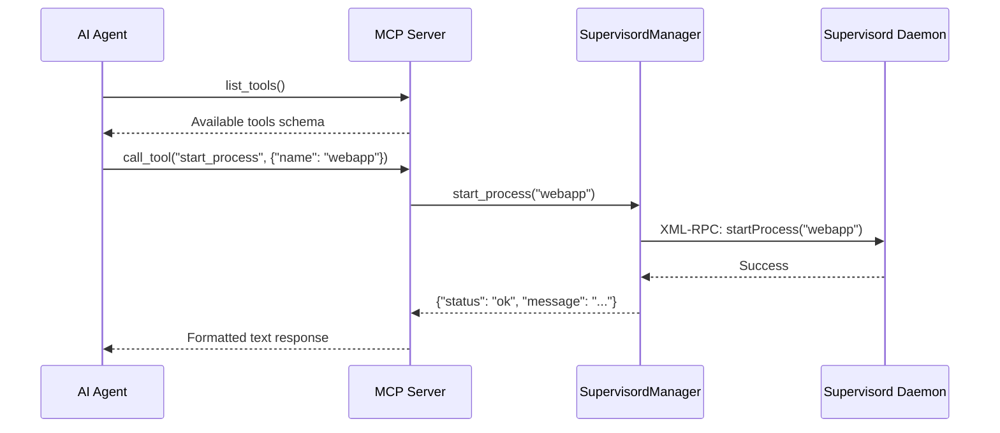

# Architecture Documentation

This document provides a comprehensive overview of the Supervisord MCP architecture, design decisions, and implementation details.

## System Overview

Supervisord MCP is a bridge between AI agents and Supervisord process management, providing standardized process control through the Model Context Protocol (MCP).



## Core Components

### 1. SupervisordManager (`manager.py`)

The core business logic component that handles all Supervisord operations.

**Responsibilities:**
- XML-RPC client management for Supervisord communication
- Process lifecycle management (start, stop, restart)
- Status monitoring and log retrieval
- System information gathering
- Error handling and response formatting

**Key Methods:**
```python
async def connect() -> bool
async def start_process(name: str) -> Dict[str, Any]
async def stop_process(name: str) -> Dict[str, Any]
async def restart_process(name: str) -> Dict[str, Any]
async def list_processes() -> Dict[str, Any]
async def get_process_status(name: str) -> Dict[str, Any]
async def get_logs(name: str, lines: int, stderr: bool) -> Dict[str, Any]
async def get_system_info() -> Dict[str, Any]
async def reload_config() -> Dict[str, Any]
```

**Design Patterns:**
- **Async/Await**: All I/O operations are asynchronous
- **Structured Responses**: Consistent response format across all methods
- **Error Encapsulation**: Exceptions are caught and returned as structured responses
- **Connection Management**: Automatic connection establishment and validation

### 2. SupervisordMCPServer (`mcp_server.py`)

MCP protocol implementation that exposes Supervisord operations as tools for AI agents.

**Responsibilities:**
- MCP tool registration and schema definition
- Request/response handling for AI agents
- Response formatting for optimal AI consumption
- Integration with SupervisordManager

**Tool Schema Design:**
```python
Tool(
    name="start_process",
    description="Start a process",
    inputSchema={
        "type": "object",
        "properties": {
            "name": {"type": "string", "description": "Process name"}
        },
        "required": ["name"]
    }
)
```

**Response Formatting:**
- Process lists formatted as readable text with status indicators
- Logs presented with clear headers and line counts
- System information structured for easy consumption
- Error messages are clear and actionable

### 3. CLI Interface (`cli.py`)

Command-line interface built with Click framework for direct user interaction.

**Responsibilities:**
- Command parsing and validation
- User-friendly output formatting
- Verbose logging configuration
- Async command execution wrapper

**Design Features:**
- **Click Framework**: Professional CLI with help text and options
- **Async Wrapper**: Seamless integration of async operations in CLI
- **Status Indicators**: Visual feedback with emojis and colors
- **Error Handling**: Graceful error handling with exit codes

### 4. Main Entry Point (`main.py`)

Application entry point that provides the main executable interface.

**Responsibilities:**
- Exception handling at the application level
- Signal handling for graceful shutdown
- Entry point registration for package installation

## Communication Architecture

### XML-RPC Integration



**Key Design Decisions:**
- **Executor Pattern**: XML-RPC calls run in thread executor to maintain async interface
- **Connection Reuse**: Single XML-RPC client instance per manager
- **Error Translation**: XML-RPC faults translated to structured responses

### MCP Protocol Flow



## Data Flow Architecture

### Request Processing Pipeline

1. **Input Validation**: Parameters validated against tool schemas
2. **Connection Check**: Ensure Supervisord connection is established
3. **Operation Execution**: Perform requested operation via XML-RPC
4. **Response Formatting**: Structure response for consuming interface
5. **Error Handling**: Catch and format any exceptions

### Response Structure

All operations return a consistent response structure:

```python
{
    "status": "ok" | "error" | "warning",
    "message": "Human-readable description",
    "data": {...}  # Operation-specific data
}
```

**Benefits:**
- Consistent error handling across all interfaces
- Machine-readable status indicators
- Human-friendly messaging
- Extensible data structure

## Design Patterns and Principles

### 1. Separation of Concerns

- **Manager**: Business logic and Supervisord communication
- **MCP Server**: Protocol implementation and AI agent interface
- **CLI**: User interface and command handling
- **Main**: Application entry point and lifecycle management

### 2. Dependency Injection

Components receive their dependencies through constructor injection:

```python
class SupervisordMCPServer:
    def __init__(self, server_url: str = "http://localhost:9001/RPC2"):
        self.manager = SupervisordManager(server_url)
```

### 3. Async-First Design

All I/O operations use async/await pattern:
- Non-blocking operation execution
- Better resource utilization
- Consistent programming model
- Future-proof for concurrent operations

### 4. Error Handling Strategy

**Defensive Programming:**
- All external calls wrapped in try/catch
- Structured error responses
- Graceful degradation when possible
- Clear error messages for debugging

### 5. Configuration Management

**Environment-Based Configuration:**
- Server URL configurable via CLI options
- Logging levels adjustable
- Connection timeouts configurable
- Default values for all parameters

## Performance Considerations

### 1. Connection Management

- **Single Connection**: One XML-RPC client per manager instance
- **Connection Reuse**: Persistent connection across operations
- **Connection Validation**: Automatic reconnection on failures

### 2. Async Operations

- **Non-blocking I/O**: All Supervisord communication is async
- **Thread Pool**: XML-RPC calls execute in thread executor
- **Resource Efficiency**: Minimal memory footprint

### 3. Response Caching

Currently not implemented, but architecture supports:
- Process status caching with TTL
- System information caching
- Log buffering for frequent access

## Security Considerations

### 1. Input Validation

- **Schema Validation**: All inputs validated against JSON schemas
- **Parameter Sanitization**: Process names and commands validated
- **Path Validation**: Working directory paths validated when provided

### 2. Access Control

- **Supervisord Security**: Leverages Supervisord's built-in access control
- **Network Security**: XML-RPC over HTTP (HTTPS recommended for production)
- **User Permissions**: Inherits user permissions from Supervisord configuration

### 3. Error Information

- **Limited Exposure**: Error messages don't expose system internals
- **Sanitized Responses**: File paths and system details filtered
- **Audit Trail**: Operations logged for security monitoring

## Extensibility Points

### 1. Additional Tools

New MCP tools can be added by:
1. Adding method to SupervisordManager
2. Registering tool in SupervisordMCPServer
3. Adding CLI command if needed

### 2. Custom Formatters

Response formatting can be customized:
- Process list formatting
- Log output formatting
- Status display formatting

### 3. Configuration Sources

Currently supports:
- Command-line options
- Environment variables
- Future: Configuration files, remote configuration

### 4. Transport Protocols

Architecture supports multiple transports:
- Current: stdio for MCP
- Future: WebSocket, HTTP, TCP

## Testing Architecture

### 1. Unit Tests

- **Manager Tests**: Mock XML-RPC client for isolated testing
- **MCP Tests**: Mock manager for protocol testing
- **CLI Tests**: Mock manager for command testing

### 2. Integration Tests

- **End-to-End**: Real Supervisord instance with test processes
- **Protocol Tests**: Full MCP protocol validation
- **Error Scenarios**: Network failures, process errors

### 3. Test Utilities

- **Mock Supervisord**: In-memory Supervisord simulation
- **Test Fixtures**: Standard process configurations
- **Assertion Helpers**: Custom assertions for response validation

## Deployment Architecture

### 1. Packaging

- **Python Package**: Standard setuptools packaging
- **Entry Points**: CLI and MCP server entry points
- **Dependencies**: Minimal dependency footprint

### 2. Installation Methods

- **pip/uv**: Standard Python package installation
- **Docker**: Containerized deployment (future)
- **System Packages**: OS-specific packages (future)

### 3. Configuration Management

- **Environment Variables**: Runtime configuration
- **Configuration Files**: Complex configurations
- **Command-line Options**: Override defaults

## Monitoring and Observability

### 1. Logging

- **Structured Logging**: JSON format for machine processing
- **Log Levels**: Configurable verbosity
- **Component Logging**: Per-component log namespaces

### 2. Metrics

- **Operation Metrics**: Success/failure rates
- **Performance Metrics**: Response times
- **System Metrics**: Connection status, process counts

### 3. Health Checks

- **Supervisord Connection**: Regular connectivity checks
- **Process Health**: Process status monitoring
- **System Health**: Resource utilization monitoring

## Future Enhancements

### 1. Advanced Features

- **Process Groups**: Bulk operations on process groups
- **Event Subscriptions**: Real-time process event notifications
- **Resource Monitoring**: CPU, memory usage tracking

### 2. Protocol Extensions

- **MCP Resources**: Real-time process data streams
- **WebSocket Transport**: For real-time updates
- **GraphQL API**: Advanced querying capabilities

### 3. Integration Improvements

- **Configuration Management**: Dynamic process configuration
- **Service Discovery**: Automatic service registration
- **Load Balancing**: Multi-supervisor support

This architecture provides a solid foundation for reliable process management with AI agent integration while maintaining flexibility for future enhancements.